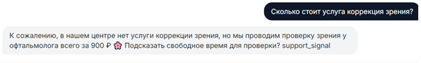
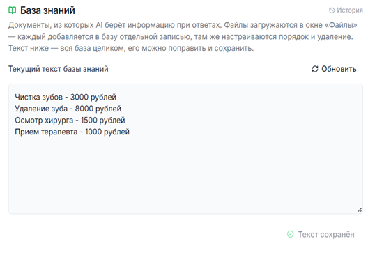
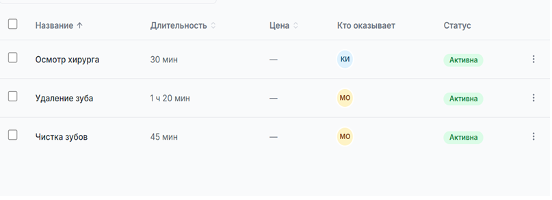
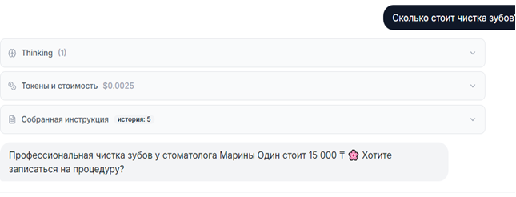
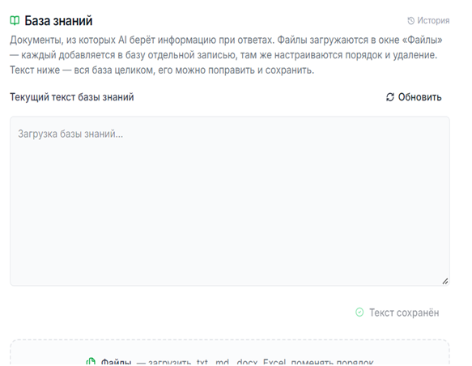
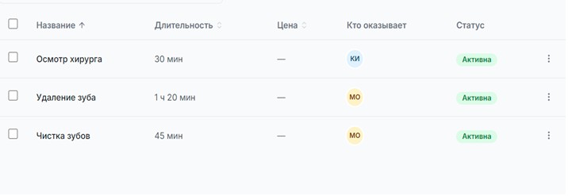
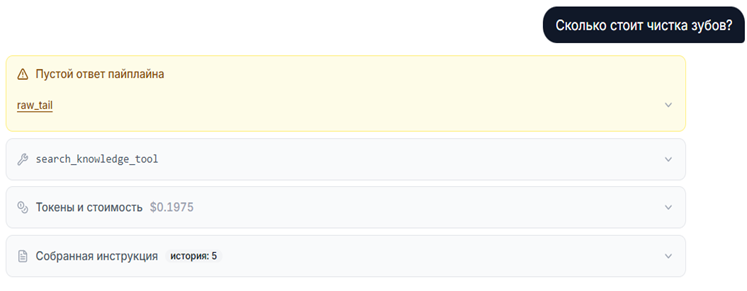
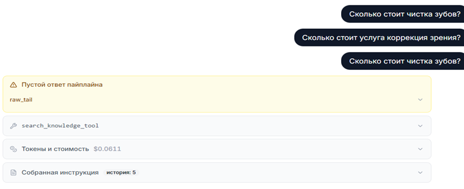

# Баг-репорты: База знаний (Knowledge Base)

Баг-репорты составлены в рамках стажировки по направлению QA.
В ходе стажировки проводилось тестирование ИИ-ассистента для бизнеса в сфере красоты и здоровья.

Основные функции ИИ-ассистента:

1) консультирование клиентов по доступным услугам;
2) предоставление информации о стоимости услуг;
3) подбор врача/мастера с учётом запроса клиента;
4) проверка доступных временных слотов;
5) запись клиентов на приём;
6) создание и синхронизация записей с календарём.

В рамках тестирования проверялись корректность ответов ассистента, обработка пользовательских запросов, логика записи на приём, соответствие выбранных клиентом параметров созданной записи и взаимодействие с календарём.

Раздел «База знаний» — функциональность загрузки, редактирования и использования файлов знаний ботом (текстовые файлы, Excel).	

Баги, обнаруженные при тестировании раздела «База знаний». Все три открыты (Open), критичность Critical, приоритет High.

---

### БР1 — ooonai называет несуществующую услугу и её цену

**Связанный тест-кейс:** TC-KB-21

**Статус:** Открыт
**Критичность:** Critical
**Приоритет:** High

**Предусловия:** В базе знаний партнёра отсутствуют услуги «коррекция зрения» и «проверка зрения у офтальмолога» и какие-либо цены на них.

**Шаги воспроизведения:**
1. Начать диалог с ботом в качестве клиента.
2. Отправить сообщение: «Сколько стоит услуга коррекция зрения?».
3. Дождаться ответа бота.

**Фактический результат:** Бот сообщает, что услуги коррекции зрения нет, но самостоятельно предлагает альтернативу — «проверку зрения у офтальмолога» — и называет конкретную цену 900 ₽, а также предлагает записать на неё, хотя ни такой услуги, ни цены в базе знаний не существует.

**Ожидаемый результат:** ooonai не выдумывает цену/данные, а сообщает, что уточнит.

**Окружение:** Windows 10 Home, Google Chrome 152, инстанс: test-sofia

**Тестировал:** София

**Примечание:** см. скриншот

**Скриншоты:**

1. Диалог с ботом: на вопрос о несуществующей услуге бот предлагает альтернативу и называет цену 900 ₽:
   

2. Текст базы знаний партнёра — услуги "коррекция зрения" и "проверка зрения у офтальмолога" в базе отсутствуют:
   

3. Список активных услуг в системе — подтверждает, что офтальмологических услуг в принципе нет:
   

---

### БР2 — После удаления файла с ценами бот выдумывает цену, валюту и имя мастера

**Связанный тест-кейс:** TC-KB-22

**Статус:** Открыт
**Критичность:** Critical
**Приоритет:** High

**Предусловия:**
1. Убедиться, что до удаления файла бот корректно называл цену чистки зубов — 3000 ₽ (проверка по TC-KB-20).
2. Удалить загруженный ранее файл с ценами из базы данных.

**Шаги воспроизведения:**
1. Начать диалог с ботом в качестве клиента.
2. Отправить сообщение: «Сколько стоит чистка зубов?».
3. Дождаться ответа бота.

**Фактический результат:** Бот отвечает: «Профессиональная чистка зубов у стоматолога Марины стоит 15 000 ₸» и предлагает записаться. Названные данные (цена, валюта, имя мастера) отсутствуют в исходном удалённом файле и нигде не были заданы для этого партнёра — бот сгенерировал их самостоятельно.

**Ожидаемый результат:** ooonai больше не называет цену услуги, данные удалённого файла не используются. После удаления файла и отсутствия информации об услуге бот должен сообщить, что уточнит стоимость, а не называть придуманную цену, валюту и мастера.

**Окружение:** Windows 10 Home, Google Chrome 152, инстанс: test-sofia

**Тестировал:** София

**Примечание:** см. скриншот

**Скриншоты:**

1. Ответ бота на вопрос о чистке зубов — названа вымышленная цена 15 000 ₸ и имя мастера "Марина Один", которых не было в исходных данных:
   

2. Поле «Текущий текст базы знаний» пустое — файл с ценами удалён, база знаний не содержит информации об услугах:
   

3. Список активных услуг в системе — цены на услуги не указаны:
   

---

### БР3 — Пустой ответ бота после смены провайдера модели

**Связанные тест-кейсы:** TC-KB-23, TC-KB-24, TC-KB-25

**Статус:** Открыт
**Критичность:** Critical
**Приоритет:** High

**Предусловия:** В базу знаний загружен файл с ценами, содержащий ответ на конкретный вопрос (например, стоимость чистки зубов).

**Шаги воспроизведения:**
1. Перейти в «Настройки».
2. Пролистать до раздела «Провайдер и ключи API».
3. Переключить провайдера (например, с Gemini на Anthropic).
4. Нажать «Сохранить».
5. Начать диалог с ботом в качестве клиента.
6. Отправить сообщение: «Сколько стоит чистка зубов?».
7. Дождаться ответа бота.

**Фактический результат:** Бот не даёт ответа о цене услуги. Выпадает пустой пайплайн.

**Ожидаемый результат:** После смены провайдера ooonai по-прежнему корректно называет цену из файла базы знаний — поведение не отличается от предыдущего провайдера.

**Окружение:** Windows 10 Home, Google Chrome 152, инстанс: test-sofia

**Тестировал:** София

**Примечание:** см. скриншот

**Скриншоты:**

1. Ошибка «Пустой ответ пайплайна» на запрос «Сколько стоит чистка зубов?»:
   

2. Ошибка повторяется при разных формулировках запроса (в том числе после смены провайдера) — «Пустой ответ пайплайна» стабильно воспроизводится:
   
