# Баг-репорты: учебные проекты

Баг-репорты, выборочно взятые из учебных проектов, выполненных во время прохождения курса тестировщика. Разные проекты и типы багов — UI, функциональные, кросс-браузерные, безопасность, конкурентный доступ.

---

### U4-10 — Текст кнопки «Перейти в справочный центр» вплотную к границам

**Проект:** интернет-магазин электроники HitechPlace

**Вид бага:** UI
**Серьёзность:** Normal
**Статус:** Открыт

**Шаги воспроизведения:**
1. Открыть главную страницу.
2. Прокрутить главную страницу в конец до раздела «Нужна помощь?».

**Фактический результат:** Текст практически выходит за границы кнопки.

**Ожидаемый результат:** Расстояние в пару пикселей между текстом и границами кнопки.

**Примечание:** Актуально для всех разделов сайта.

**Тестировал:** София

---

### U4-11 — Наложение элементов во всплывающем меню

**Проект:** интернет-магазин электроники HitechPlace

**Вид бага:** Cross-Browser
**Серьёзность:** Major
**Статус:** Открыт

**Предусловия:**
- Тестирование проводилось на iPhone 12 pro max
- Браузер: Safari

**Шаги воспроизведения:**
1. Открыть главную страницу.
2. Открыть всплывающее меню нажатием на три полоски.

**Фактический результат:** Крестик для закрытия меню съехал вниз и перекрыл пункт меню «Помощь».

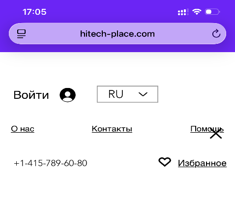

**Ожидаемый результат:** Перемещение крестика для закрытия в правый верхний угол.

**Тестировал:** София

---

### U4-95 — Некорректный подсчёт записей в полях «Records in List» и «Total Records»

**Проект:** программа ListBoxer для создания алфавитно-цифровых универсальных списков

**Вид бага:** Functional
**Серьёзность:** Critical
**Статус:** Открыт

**Шаги воспроизведения:**
1. Запустить программу.
2. Выбрать режим «Numeric» в графе «Symbols».
3. Внести в список цифры от 1 до 16.

**Фактический результат:** Позиций в списке 16, а значений в графах «Records in List» и «Total Records» — 15.

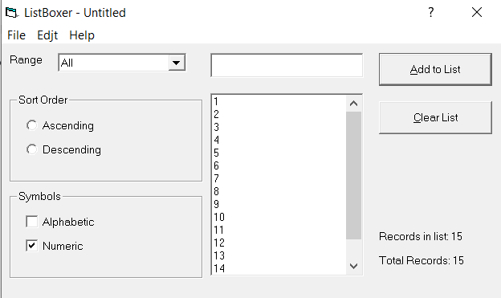

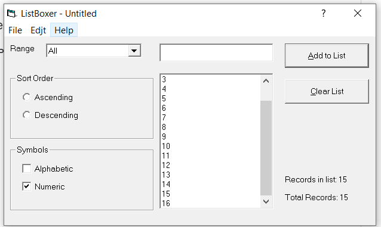

**Ожидаемый результат:** Значения в графах «Records in List» и «Total Records» соответствуют количеству записей в списке.

**Тестировал:** София

---

### U4-114 — Реакция на XSS-инъекцию в поле «Название» встречи

**Проект:** web-проект EspoCRM, которое позволяет создавать задачи, контрагентов, просматривать календарь, планировать встречи, вести бухгалтерию и конфигурировать интерфейс под свои цели.

**Вид бага:** Security
**Серьёзность:** Critical
**Статус:** Открыт

**Шаги воспроизведения:**
1. Открыть главную страницу сайта.
2. Перейти в раздел «Календари».
3. Нажать на любое место в календаре.
4. Прописать `` в поле «Название» встречи.
5. Заполнить обязательные поля.
6. Нажать кнопку «Сохранить».

**Фактический результат:** Происходит реакция на скрипт (выполняется JavaScript-код, введённый в поле).

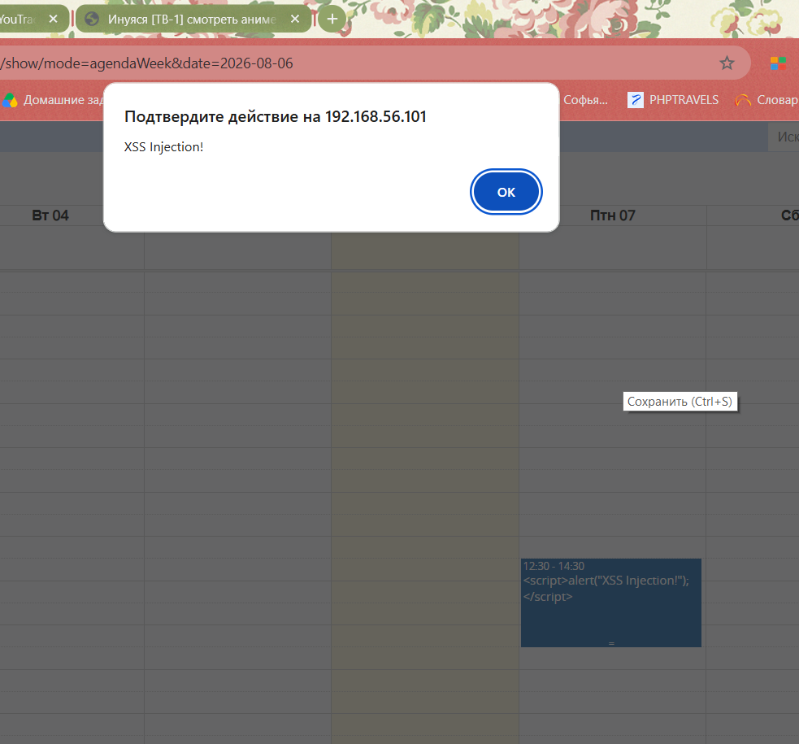

**Ожидаемый результат:** отсутствуют какие-либо изменения при вводе скрипта

**Тестировал:** София

---

### U4-119 — Невозможно восстановить пароль из-за необязательности поля «Эл. почта»

**Проект:** web-проект EspoCRM, которое позволяет создавать задачи, контрагентов, просматривать календарь, планировать встречи, вести бухгалтерию и конфигурировать интерфейс под свои цели.

**Вид бага:** Functional
**Серьёзность:** Blocker
**Статус:** Открыт

**Предусловия:** 
- Создать пользователя в разделе «Пользователи», заполнив только обязательные поля

**Шаги воспроизведения:**
1. Открыть главную страницу сайта.
2. Нажать на 3 полоски в правой верхней части экрана.
3. Нажать кнопку «Выйти».
4. Нажать кнопку «Забыли пароль?».

**Фактический результат:** При создании пользователя адрес электронной почты не является обязательным полем. Невозможно восстановить пароль.

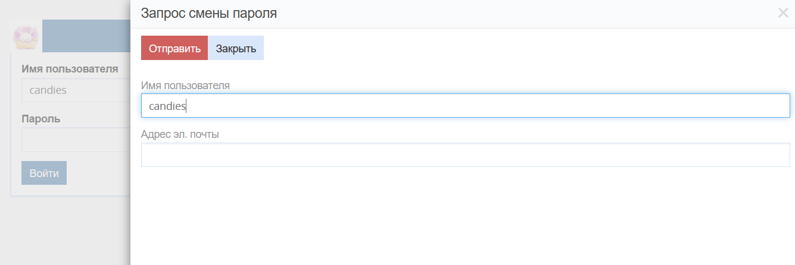

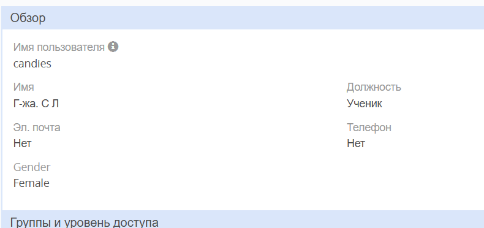

**Ожидаемый результат:** При создании пользователя электронная почта является обязательным полем. Нельзя сохранить пользователя с пустым полем «Эл. почта».

**Тестировал:** София

---

### U4-122 — Некорректная валидация полей «Имя» и «Фамилия» в разделе «Контакты»

**Проект:** web-проект EspoCRM, которое позволяет создавать задачи, контрагентов, просматривать календарь, планировать встречи, вести бухгалтерию и конфигурировать интерфейс под свои цели.

**Вид бага:** Functional
**Серьёзность:** Major
**Статус:** Открыт

**Шаги воспроизведения:**
1. Открыть главную страницу сайта.
2. Перейти в раздел «Контакты».
3. Нажать кнопку «Создать контакт».
4. Ввести в поле «Имя» символы.
5. Вставить в поле «Фамилия» любую ссылку.

**Фактический результат:** В поля «Имя» и «Фамилия» допускается ввод цифр, символов, ссылок.

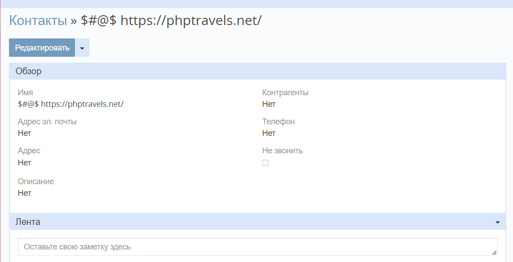

**Ожидаемый результат:** В поля «Имя» и «Фамилия» можно вводить только буквы на латинице и кириллице, первая буква — верхний регистр, остальные — нижний. Допускается ввод символов «пробел» и «-», если имя двойное.

**Примечание:** Аналогично при создании кандидата.

**Тестировал:** София

---

### U4-126 — Устаревшая информация о ценах в разделе «Вопрос-ответ»

**Проект:** интернет-магазин "Истари Комикс"

**Вид бага:** Usability
**Серьёзность:** Major
**Статус:** Открыт

**Шаги воспроизведения:**
1. Открыть главную страницу сайта «Истари Комикс» (istari.ru).
2. Пролистать страницу до конца.
3. Перейти в раздел «Вопрос-ответ».

**Фактический результат:** В разделе «Вопрос-ответ» представлена устаревшая информация о ценах товара.

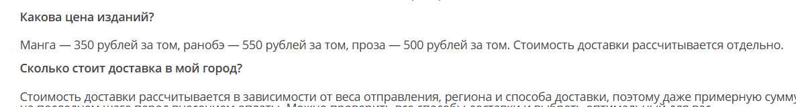

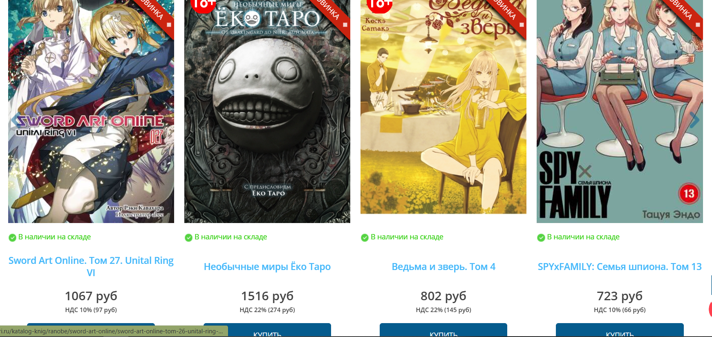

**Ожидаемый результат:** Удалить вопрос «Какова цена изданий?» и ответ на него — фиксированной цены на издания нет, актуальные цены представлены в описании товара.

**Тестировал:** София

---

### U4-130 — Удаление контакта после отзыва прав администратора

**Проект:** web-проект EspoCRM, которое позволяет создавать задачи, контрагентов, просматривать календарь, планировать встречи, вести бухгалтерию и конфигурировать интерфейс под свои цели.

**Вид бага:** Concurrent
**Серьёзность:** Blocker
**Статус:** Открыт

**Предусловия:**
- Зайти в программу как администратор «А» в браузере Google Chrome.
- Зайти в программу как администратор «Б» в браузере Mozilla Firefox.

**Шаги воспроизведения:**
1. Открыть главную страницу сайта.
2. Перейти в раздел «Контакты» как администратор «А».
3. Нажать кнопку «Создать контакт».
4. Заполнить обязательные поля.
5. Нажать кнопку «Сохранить».
6. Снять права администратора с пользователя «А» как администратор «Б».
7. Удалить созданный контакт как пользователь «А».

**Фактический результат:** Контакт удаляется, хотя права на удаление были отозваны.

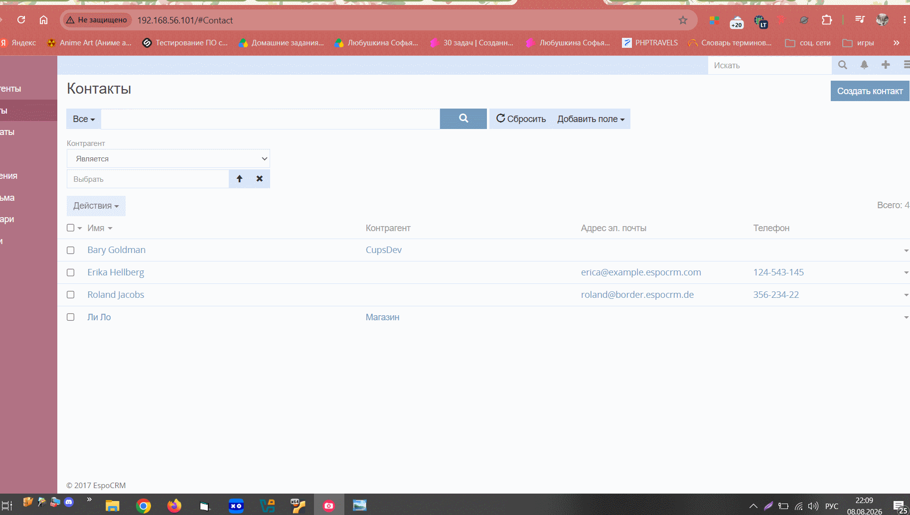

**Ожидаемый результат:** Должна появляться подсказка: «отсутствуют права администратора».

**Примечание:** Если удалить ранее созданный (не только что) контакт в разделе «Контакты» пользователем, у которого только что забрали права администратора, вылетает ошибка.

**Тестировал:** София

---

### U4-133 — На странице бронирования визы присутствует ошибка 404 в консоле

**Проект:** web-проект PhpTravels - сервис бронирования авиабилетов, туров, отелей и транспорта

**Вид бага:** Functional
**Серьёзность:** Normal
**Статус:** Открыт

**Шаги воспроизведения:**
1. Открыть главную страницу сайта.
2. Перейти в раздел "Visa".
3. Заполнить обязательные поля.
4. Нажать иконку поиска.

**Фактический результат:** в консоле появляется ошибка 404 - *тут был бы приложен txt-файл с ошибкой из консоли*

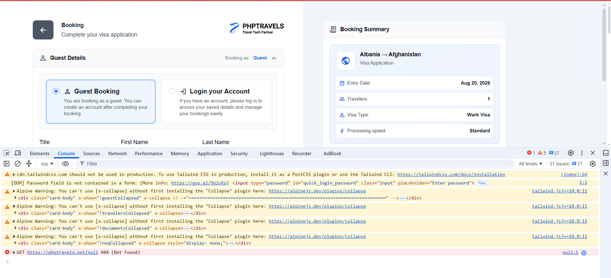

**Ожидаемый результат:** ошибка в консоле отсутсвует

**Тестировал:** София

---

### U4-134 — Пустая страница «Best Travel Deals»

**Проект:** web-проект PhpTravels - сервис бронирования авиабилетов, туров, отелей и транспорта

**Вид бага:** UI
**Серьёзность:** Major
**Статус:** Открыт

**Шаги воспроизведения:**
1. Открыть главную страницу.
2. Прокрутить страницу до конца.
3. Перейти на страницу «Best Travel Deals».

**Фактический результат:** Страница пустая, отсутствует какая-либо информация.

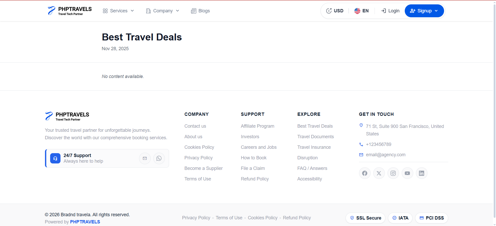

**Ожидаемый результат:** На странице имеется информация.

**Тестировал:** София
